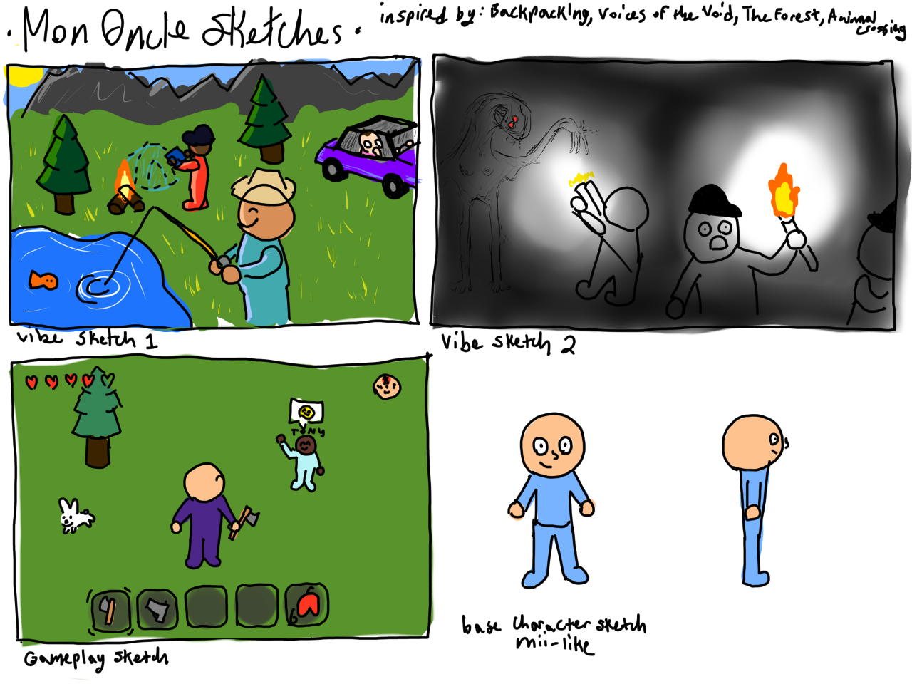
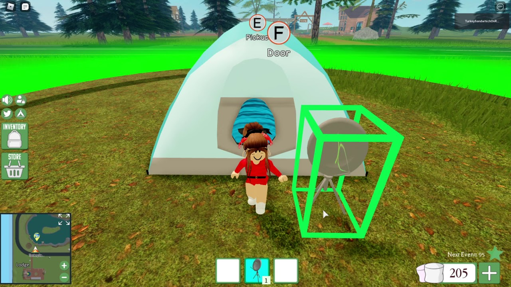
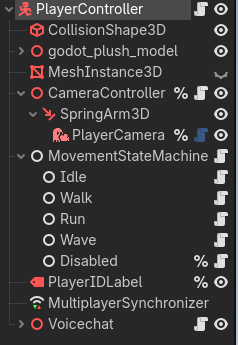
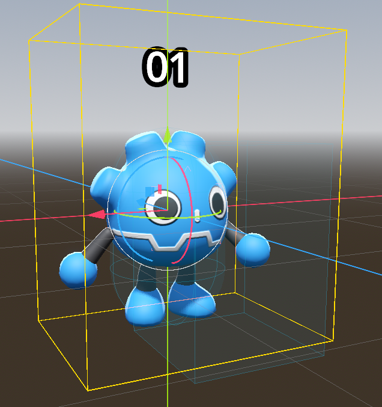
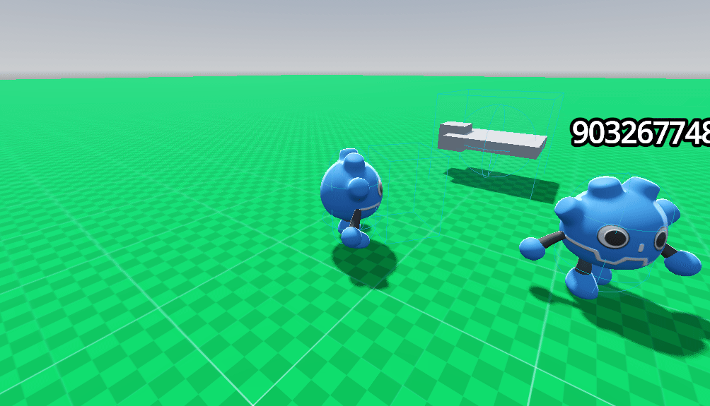

# Make a Thing - Jan 21, 2026

It's been some time since I last finished a project in Godot. Coming into this, I knew I wanted to re-familiarize myself with my tools, the process, or whatever you call it. I took the opportunity to re-read the docs, and let my mind loose onto the novel ideas it could harbor.

The first idea I had was an old one. One I remember distinctly coming up with and pitching to my partner while on cal approximately 2 years ago. It involved polishing a dirty ball. Once cleaned, the game would celebrate with confetti and reward the player with a short ceremonious tune. However, the game would not close. Players could then continue polishing the ball, as more and more of the ball would be removed. The point being players would eventually polish the flesh off the ball, until the ball would simply vanish. When I first came up with idea, I had no idea how I would pull it off. I have no ability in sharer programming, and at the time little ability in using Godot. So I kept the idea locked in the far reaching depths of my empty mind. With this project, and my technical growth, it finally felt time to bring this idea out of the woodwork and flesh it out. However, before putting any work, I decided to let my other ideas breath.

The second idea involved a mech suit. I'm a big fan of games that offer diagetic interactions with mechanical systems, and I've been wanting to make a game akin to Steel Battalion. Considering the short time frame at hand, I had to scope the idea down a bit. I wondered, "what if the entire game was just turning this thing on?", what if I made a game that only required the first step? Maybe the game could have a manual, one that only existed in game? Maybe the mech is ridiculously difficult to turn on and even has times sequences that must inputted perfectly. I don't know. The idea sounds fun on paper, and not to difficult to setup.

Last but not least, my fire idea. I mean fire alarm idea. This one came to me very last minute, which is funny considering it's the one I stuck with. Essentially, the idea was that I would place players in a house and give them the goal to find and turn off the fire alarm. The whole game would be a prank however, the joke being there is no actual fire alarm. The more I thought about it, the more I could see myself turning this into a horror game, with more and more fire alarms joining in and creating a cacophony of hell. Thinking about exploring this house, I started feeling nostalgic about the 8800 Blue Lick Road listing. This voiceless infinite dripping in mystery and tar. I just really liked the idea of playing a game through the confines of a house listing. As you might have noticed I really enjoy thinking about how players interact with games, and much of my ideas come from exploring the relationship we have with this second reality.

With my nostalgia at hand, and having essentially dreamed up the code that would be required, I set haste for the development of this new and imposing project. I started working on the character controller. Again taking inspiration from generic house listings, I refactored some old code and made a very basic controller in a very small amount of time. Much of my time was spent debugging, or at least realizing that one of my UI nodes was eating up my mouse inputs, making it so my 3D collisions could not detect the mouse entering and exiting their shapes. Once all of that was sorted out, I finally had the beginnings of a game. 

The most 'obvious' part of this game is it's unique visual style. This is about when I came up with it. The idea came from browsing itch.io and looking at some random Decker projects. I've tried using Decker in the past, and am a big fan of it as an idea, but I've always found it very obtuse to use. The visual style Decker proposes is unmatched however, and so I attempted to emulate it with this project. What would it look like to browse an old house listing designed for technology that wasn't ready? I grabbed an old shader shared on the Godot Shaders website, one I had used in the past and I modified it to make it work for this project. I instantly fell in love with look and simply expanded it based on the artificial context I had provided.

By the time I had most components, I realized I had to make a house to explore. I sadly did not have the time to model my own, so I grabbed a very iconic house model used in a plethora of horror slop found online. I got a free fire alarm sound from freesound, added that in and the boom, I had a game. At least, I thought I did. As I added places to explore in the house, the empty stillness began getting to me. I immediately called back to museums, and how they would setup a scene for you to explore, and then add sound effects to help bring you intro their stories. This game was missing that, a sense of place, a story to tell. So I started grabbing a bunch more sounds from freesound and placing them around the house. Adding stories, ideas, life to this house. The house may be empty, but it also didn't have to be. It was around here where I thought it'd be funny to add a scary easter egg, so I grabbed a free spooky model and snuck it in with a scary sound. I then added more scary sounds, help add tension to the game.

With the project done, I must say I am fairly proud of myself. I spent a total of 8 hours on this, and ended up coming up with a fairly weird and unique experience I don't think I would have ever come up with weren't for this class.

# Rob Ford - Jan 29, 2026

Rob Ford is a fascinating figure. A genuinely crazy, nearly mythical figure who has reshaped the city of Toronto for better and for worse. Much worse. Why oh why does this journal begin with a mention of Rob Ford you may ask?
## Ideation
Last week, I watched a video by [Youtuber Bobby Broccoli](https://www.youtube.com/watch?v=nACJOKV_YYA&pp=ygUOYm9iYnkgYnJvY2NvbGnYBuEg) while working on the [[#Make a Thing - Jan 21, 2026]]. The video discusses the Ford family, focusing primarily on the illustrious figure of Rob and his general happenings while he was still with us. Watching this video, I was completely taken aback by the shear pragmatism and pro-activeness Rob illustrated. How can someone make their phone number public, and then make all attempts to consistently answer it whilst help the people on the other side of the line? The man was genuinely crazy, in quite the charismatic way. Since this video, I've been constantly thinking about the man. His crack addiction, his blatant lies and constant destructuring of the government, his volume-us stance. Why don't we have a game about Rob Ford?

Another video that's been surfing the ridges of my brain is [this one](https://www.youtube.com/watch?v=OJMBIr90L80) about the game [Gangland](https://www.myabandonware.com/game/gangland-cub). The game itself doesn't follow a specific decipherable structure, and is fairly impossible to describe with playing it. Gangland is clearly inspired by the RTSs of its time, attempting to combine the experience of controlling a mini army, with the expensive business sims found in other tycoon games from that same time. Combined with some RPG progression systems sprinkled in, Gangland remains one of the most mind altering gaming experiences out there, redefining what a game can be.

The main idea that's been orbiting my [field of vision ](https://www.youtube.com/watch?v=dGt-0qi8p4Q&list=RDdGt-0qi8p4Q&start_radio=1&pp=ygUcZmllbGQgb2YgdmlzaW9uIGtpbmcgZ2l6emFyZKAHAQ%3D%3D) this week is a combination of Rob Ford and Gangland. A competitive mayoral race, where players actively manage parts of their town while attempting to sabotage others. Players can either complete tasks individually and save on funds, or attempt to balance a budget to open up their personal time. The game would be controlled similar to Gangland, with units that could be sent out to different locations in town as players attempt to make sense of a plethora of menus. 

This game so far only exists as an idea, not even a paper prototype. Its easy to get ideas in game dev, especially when you're someone wholly derivative. The problem is in actualizing said ideas. I've never made anything related to multiplayer throughout my entire game dev journey, though there have been attempts. Every single time, I am completely fall apart as individual, frightened by the drowning documentation hiding underneath the soles of my show. I stutter and I grimace, until I am just ash. For this idea though, it feels a lot more doable. As a whole, I've found that systemic game design is far easier then 3C or any other. I've made plenty of board games, and balancing said board games has always come somewhat naturally to me. For this idea, that's likely where I will start. A simple and effective paper prototype, see if the idea has legs, as mentioned by you last class.
## Work
I wish I got the chance to work more on the physicality of this idea this weak, however work got in the way. When I say work, I mean the main game I'm working on for the Behavior Design chair thing. This week I added a reactive UI, and updated the computer interface system to actually make it seem like a computer system. I also began implementing some assets provided by our resident artist on the project. 

![[ksnip_20260129-111209.png]]

This game alone is the most ambitious project I've ever been on. There are multiple systems of interaction, different mini-games, a dialogue system, a complex progression system, just...eugh.... And I am the sole programmer/game dev on this project. It's better this way, since it means the codebase can be as messy as I need it to be. But what it means is that I essentially do all the work. I'm fine with that, and have been learning suprisingly a ton, its genuine life experience for the better. Its just all so very tiring.

## Class
This week, I didn't work on anything but getting myself ready for this next class. I have setup C# properly for Godot, connected Rider and all, and even gotta some basics down for the game we're likely to make this next class. 

I've been questioning myself about what I want to learn throughout this course. I think I need to push my ideas a bit more, give myself space for them. This week I had a breakdown during work of just pure mental exhaustion in lack of self expression, and I felt the desire to make something random so desperately come to me. I think for me this is what this class should be, just experimentation. See what can I actually make. Tiny day long game jams, push myself and my portfolio.

# Car Pong - February 5th, 2026

I've been slowly writing parts of this journal throughout the week, the same way I've been working on this idea. However, I haven't properly formatted it or put my thoughts together, so this entire journal is effectively being written now.
## Jan 29th

This idea started in class last week. When discussing pong variations, I don't know how the idea appeared, but I just imagined being in a car and trying to play pong. I found the idea funny enough to stick with it and flesh it out in my head. Would it be 2D, 3D? How would you score, would it be like normal pong?

At first I settled with the idea of having the paddle as the front bumper to the car, and immediately imagined that losing would come from having any other part of the car hit by said ball. The game could be 2D, and control somewhat like the old GTAs. During the class, I had spent the entire time recreating the projects you had shown us, so I already had the components for what would eventually become **Zamboni Pong**.

## Feb 1st

This was the big development day for me. Nothing planned on a Sunday, I could take as many hours required to make whatever I could dream. The first thing I wanted to work on however was the character controller.

For this, I made a first try iteration trying to figure out how to get the car to proceduraly turn, like a real car. Without looking at any tutorials, I set out to figure it out by myself. I had the car moving front and back,  but just could not figure out turning. I eventually relented and found 2 tutorials that could help. [tutorial 1](https://phaser.io/tutorials/box2d-tutorials/top-down-car-physics), [tutorial 2](https://kidscancode.org/godot_recipes/4.x/2d/car_steering/). Tutorial 2 specifically had the exact code I needed, and once implemented I finally figured out how I was supposed to make it. The quick explanation is this, you have a front wheel point, and a back wheel point. The back wheel point will generate a vector that points forward in relation to the car. The front wheel point on the other hand will generate a vector that originally points forward, but is then is rotated based on player turn input. Get a new vector from the back wheel vector that points to the front wheel vector, and now you have your desired 'heading'. Now you just see if we're moving forward and back and change the velocity to match this new heading, and then simply rotate the character based on the heading and current velocity. The big thing I could not initially figure out was using to vectors, but once the tutorial explained it it made so much sense.

I was quite brain dead on this day. Initially, I thought the ball should be a 'character body'. In Godot, this is a physics body where you code your own logic. This meant I'd have to code my own bounce logic, my own physics, etc etc. Again, took me too long to realize that I should just use a Rigidbody and apply a generic force. For hit detection I went lazy and instead of parsing the collisions the ball has, I created added an Area2D and simply set the collision layers in way that it could only detect the players. And for the ball speeding up, I just have a timer repeating every 0.5 seconds that adds a little bit of force to the ball based on the direction its going.

The biggest take away from this day was how better it is to be lazy with your code. I struggle a lot with preemptive optimization, and it can be hard for me to simply get an idea out once I have it. By just trying to do something, not caring about art, not caring about cleanliness of code, I did actually get a proper game out that fully works and I can get people to play.

![[Peek 2026-02-05 12-38.gif]]

## Feb 4th

This was the first time I got someone to play my game. Immediately, some issues and suggestions arisened. 

For one, score was not kept. So I quickly implemented a scoring system that added a point any time a player remained alive, and then displayed said points. However, this was a nominal issue. The biggest issue which I already feared to encounter was the fact players had no incentive to effectively move. Standing idle, or close to idle, was often times the best solution to winning. I fixed this by it so players would lose if they didn't move after a period of time. I don't want to go in to much detail on how it works, mainly because it is the junkiest worse thing I have ever made. But it works. Players have 5 seconds of idle time, if they don't move the time goes down. If they do move the time goes back up. Simple, and yet the code is all over the place, mainly cause I didn't use a state machine. My next step is likely going to be implementing more rigorous data frameworks, and specifically a state machine.

While playing my game, I started feeling deeply nostalgic about flash games from years past. I remembered sitting in computer class, and ignoring my teachers while playing some random games I'd find around. A very innocent time. Anyways, my future plans are to dig into this Flash like aesthetic. I've already done research into vector art programs, and plan on utilizing them to generate the look. Now, the title of this journal is still Car Pong, and that's because by this point the game was still Car Pong in my mind. However after my small playtesting session, and my "ITS A FLASH GAME" vision, I realized that the ball wasn't a ball. The ball was in fact a puck, and the cars were Zamboni's on the ice trying to avoid it!

So for next week, my goal is to polish this game. Add a menu, make state machines, and maybe even start adding art assets. I'm aiming for a look feel prototype, see if I can get the look of the game out.

Thanks for reading this weeks journal! Sorry I couldn't make it to class today.

# Art - Feburary 12th, 2026

This weeks journal isn't gonna be big. A lot of my thoughts, and what I wanted to do this week was already laid out last week.

This week, I made art. Simple, flash inspired art using a fork of the Wick Editor called Candlestick. I have inserted myself in the community, writing bug reports on their discord, and reading the code base in an attempt to fix said issues. The software itself is really nice to use, especially as a simple vector painting type of program. I especially enjoy the ability to use pressure with the brush, allowing for a much more realistic approximation of what I call the flash look.

The game is coming along, and will hopefully be done by this week. I'm really just at the polishing stage of development, now that the idea feels fleshed out, and fun to play. More might be added after the polish run, such as powerups, or puck power ups. (Oh yeah the ball is called the puck now). I don't much being added however, the simplicity adds a lot to the atmosphere and experience.

The big thing I want to do next is go back through some old games of mine and 'flash' them up. I have this blind Gomoku idea (that I stole from the show Devil's Plan) I never finished making. I have my ItMattress game that I'd like to properly flesh out also, and make more effectively. Oh and my survivors like that I marginally worked on 2 years ago, before I had the skills to actually make games.

However, the next big step in my game making journey is something called Bevy. A rust based, ECS structured game engine. It doesn't come with an editor, but someone made a plugin that lets Bevy and Godot interface. I've been doing more and more research into ECS, and it's looking to be my saving grace when it comes to complex structure and architecture.

Anyways, again not a big week. Thanks for reading.git

# Rough Week - Feb 19th, 2026

Last 2 weeks have been really rough for me. I haven't worked on any thing video game related really, not even my main job. Main reason being my 3D class and my songwriting class eating up my time. Luckily, both are essentially finishing this week! (at least the workload is slowing down), so I'll finally be able to hop back into Godot and do something.

That doesn't mean I haven't been looking into my final project. Or haven't been making anything! 

## Mon Oncles Camping Game

For the past 3 years, I have had this idea laying around in the back of my head. I used to play a lot of Roblox with a specific friend group, and one of our favourite games was this campig game called [Backpacking](https://www.roblox.com/games/1997193809/Backpacking). There's not much to do, but the big selling point is the campsite customization mechanic. You can pick a small section of land, and then place different camping related furnishings onto it such as tents, benches, and more. My friends and I loved taking our time and making these massive campsites where we would RP drinking beer and fish. My friends live faraway (one in the netherlands), so this is the closest we have to the 'rugged camping' experience. 3 years ago, I was also very into [Cabela Hunting Games](https://altarofgaming.com/franchise/cabelas/). These were old im-sim type games that let you explore the vast wilderness, and attempt to track down different beasts roaming the land. So at the time, I kept thinking about a what if scenario of combining these 2 experiences into one, so my friends and I could actually go camping.

At the time, I had actually attempted to put work into it. I had this very strange controller scheme (similar to the game [Kenshi](https://store.steampowered.com/app/233860/Kenshi/)), and had started some networking features. 3 years ago though, I had no skill, and no foresight at how difficult a project like this was to undertake. I quickly quit and have since put this idea on the back burner of my mind since.

Last week, I saw [this reddit post](https://www.reddit.com/r/godot/comments/1r4rms0/finally_started_making_my_game_look_like_a_game/](https://www.reddit.com/r/godot/comments/1r4rms0/finally_started_making_my_game_look_like_a_game/ "https://www.reddit.com/r/godot/comments/1r4rms0/finally_started_making_my_game_look_like_a_game/") )of someone's multiplayer golf game. The aesthetic was so perfect and on point, I immediately felt quite inspired. When I shared it with my partner though, they reminisced of my old hunting game I had pitched to them, and said it reminded them of my idea. Since then, I have not been able to get it out of my head, and all I want to do is work on this old hunting game idea again.

So for the remainder of the semester, that's likely what I plan on doing. I'll craft different systems, and see how they interact with each other, and try to pry out some interesting gameplay loops.

## Stalin is Dead

A couple of days ago, my partner and I were talking about things we were watching. On their end, they've been watching the new Game of Thrones series. I've never watched Game of Thrones, but I've always wanted to. Just never had the time to give it proper respect and attention. On my end, I've been watching Blood on the Clocktower gameplay non-stop. It's been very useful at passing the time, as a semi cafe ambiance as I deal with the horrors of 3D. While talking, I asked them what they'd think a Game of Thrones role playing game would look like. They pitched a semi idea of voting for a king, and I immediately expanded on it. Since our talk, I have been thinking non-stop about this roleplaying game idea, and am planning on bringing it to life.

Stalin is Dead is a 5-10 player hidden role game about figuring out who to make the next leader of the communist party. The game plays like werewolf, with a day and night cycle. During the day, the current selection for leader is announced (chosen during the night by the 'kingmaker') and players must vote to keep this individual as leader or remove them. If players vote to keep this person as leader 2 days in a row, they are officially crowned leader of Russia. The thing is, not everyone is on the same team. Some of you are staunch communists, ready to move forward with the ideals brought your past leader. Others are liberals, trying to dismantle and save Russia from its authoritative government. 

The game works like any hidden role. Players gather information, and try to figure out who is and isn't on their team. Oh yeah, players don't know who is on their team. So the entire time people are weary about sharing their political leanings.

Have to cut this journal short, but thanks for reading.

# Mon Oncles Hunting Game - Feb 26th, 2026

This journal will be used as a fleshed out pitch for the MonOncle idea I presented last week. MonOncle sets out to answer one question. **I want to feel like I'm out camping with my friends, how can I make that a game?**

## Pitch

Mon Oncle's Hunting Game is a multiplayer camping experience where players are tasked with hunting different [eldritch beasts](https://en.wikipedia.org/wiki/Junji_Ito), commit odd jobs around town, and design and build different campsites for personal use.

Set in rural Quebec ([Ferme Neuve](https://en.wikipedia.org/wiki/Ferme-Neuve)), players will have access to a large map with small towns sprouted around, housing different denizens living in and around the wilderness. Players will have the chance to navigate this map using either cars, trucks, boats, 4 wheels, or their own 2 feet. With densely rich and abstract lore inspired by Canadian folktales, players will tackle different 'events' and beasts that might make them question their own reality.

The game is primarily inspired by the Roblox game [Backpacking](https://www.roblox.com/games/1997193809/Backpacking ), using the collective camping experience as a generic foundation for the experience. MonOncle is also inspired by the game [Voices of the Void](https://mrdrnose.itch.io/votv), attempting to emulate the contrast between casual-simulation and unbound horrors. 

Aesthetically, the MonOncle will attempt to emulate games found on the Wii, primarily ones that had Miis. In fact, the player character model will attempt to closely emulate Miis, providing similar customization and expression. Games aesthetically inspired by include, [Tomodatchi Life](https://en.wikipedia.org/wiki/Tomodachi_Life), [Wii Sports](https://en.wikipedia.org/wiki/Wii_Sports), [Wii Fit](https://en.wikipedia.org/wiki/Wii_Fit), and most importantly [Animal Crossing New Leaf](https://nookipedia.com/wiki/Mii).
## Backstory

Back in late 2022, I picked up a game engine called Godot. The 4.0 update was coming around the corner, and it felt an opportune time to attempt learning it. I had tried and failed using Unity multiple times in the previous years, but Godot instantly clicked.

At that same time, my friends and I (who I spent a lot of my covid time with) were getting into this Roblox game called Backpacking. One of my friends lives in the Netherlands, and I still to this day have net met them in person. We all collectively enjoy the 'camping' experience, and wanted to live it together, so a Roblox game offering a simulacrum felt like a desirable compromise. 

Backpacking offers quite the novel environment for role-playing 'camping'. You can fish, drive around and explore a large map, and settle down anywhere to create your campsite which you can then customize to your hearts content. Unsurprisingly, my friends and I put many hours into Backpacking. However, even with all the praises I have sung, Backpacking sucks. It is quite buggy, and the experience only exists within a framework that is benefited by child exploitation.

Sadly, outside of Roblox, no game matches the intrinsic casualness and meditative creativity that Backpacking provides. No game even provides a proper casual camping experience that my friends and I can quickly jump into and drink a few pixelated beers. So with my newly gained Godot experience, and my passion for an artificially recreated american experience, I set out to recreate Backpacking.

The horse hit the cart nearly immediately, or at least 2 months of work in as I realized I did not have the experience to create this project. I had clearly over-scoped, and the vision I had for this game was much laborious then intended. As time went on, many new games have released somewhat emulating the experience I had put to paper. [Lethal Company](https://store.steampowered.com/app/1966720/Lethal_Company/), [Webfishing](https://store.steampowered.com/app/3146520/WEBFISHING/), and even Voices of the Void had become much more fleshed out and polished. However, Voices of the Void was still singleplayer. Lethal Company was much more a horror game with a tight gameplay loop then what I had originally envisioned. Webfishing is much more a chatroom then anything else. And to this day, no one has attempted to copy Backpacking.

2 weeks ago(as mentioned in my last journal), I found a [Reddit post](https://www.reddit.com/r/godot/comments/1r4rms0/finally_started_making_my_game_look_like_a_game/) of someone sharing their game. Aesthetically, the game is quite inspiring. The nostalgic escape back to when games were still strange and experimental. When sharing it with my partner, they immediately reminisced about my old hunting game I had pitched. Since then, I have been thinking about MonOncle non-stop. You know when you just get a flash of inspiration and it sticks in your mind, that's what happened to me.

## Plan Moving Forward

The first 2 things I need to immediately get down is a basic character controller, and networking. I've made hundreds of character controllers over the years, so that should come without difficulty. However, my biggest struggle will be networking. Luckily, there are many more tutorials then there used to be so learning how to make an online multiplayer game should no longer be too hard.

***Tutorial List:***
 - [Friendslop Networking](https://www.youtube.com/watch?v=NvG08tA06xQ)
 - [VOIP](https://www.reddit.com/r/godot/comments/186yn4o/voip_in_godot_basic_overview_not_full_tutorial/)

Once a my character controller is implemented with basic networking, a building/placement system will come next. Some basic interaction system, and inventory management system, and then voila. All of this should be a couple of days work based on past experience.

The main thing I want to experiment and prototype is 'systems loop' I have planned out. MonOncle will offer players different gameplay paths to progress and upgrade themselves, in turn motivating them to explore and try out different experiences. For example, players might highly enjoy fishing and solely commit to that experience. However, to progress players will have to commit certain delivery tasks to obtain an exclusive fishing rod. The idea is to that have these isolated systems reward benefits to other systems. 

The Main Gameplay 'Experiences' I want to explore are:
- Camping (ie building you campsite, placing a fire down)
- Fishing
- Driving (with Delivery system)
- Hunting
	- Though the game is called a hunting sim at the moment, hunting will primarily involve picking a target from town. (such as a Sasquatch) Then going to the spotted area on the map, setting up camp, and finding clues and 'tracks' to track the beast down.
	- Hunting will be the core motivator for the game, providing the most reward and incentive for players to remain as nomadic as possible. However, the idea is that hunting should take a long time, acting much more like the main quest in Breath of the Wild. Hunting will be very similar to hunting in monster hunter, without having a HUD world you constantly exist in.
- Exploring (with a random event system such as Voices of the Void)
- Cooking
- Light Resource Gathering

Though Hunting is a major part of the game I imagine, I really just want to make a game where I place things down with my friends and can role-play living it. Though it might seem like I have some concrete ideas for how this game should be, the only concrete idea is the general vibe and experience I want to emulate. **I want to feel like I'm out camping with my friends, how can I make that a game.**

Moving forward, this is the pillar that will guide all design decisions. Players must be able to 'shoot the shit'. The game has to be simple, easy to pick, and allow players to feel as if they are out in the middle of nowhere collectively dealing with the uncertainty of nature.

*ps. i've been reading the book [the fisherman](https://en.wikipedia.org/wiki/The_Fisherman_(novel)) as inspiration. highly recommend*

# Online - March 12th, 2026

This week (or weeks but only worked on the prototype this week sadly), I had one question to figure out. How does networking work? 
## Github

Before going any further, I need to provide a small story. What happens when you work on another project, and you need to revert changes you make. So you try to stash but the Github UI doesn't provide a way to stash so you delete unfazed by the work you loss on your other project. Only then realize do you weren't on the correct project. I lost about 10 hours of work that I'd invested in MonOncle, and I wouldn't lie saying it's been incredibly difficult to hop back on this project. I've never had this issue once in the 10 years I've used Github, but I also rarely jump between multiple repositories in one week. Anyways, I've been questioning the validity of continuing, but I'll make do.

Due to this lighthearted happenstance, **I do not have any visual component to provide for this week**. I'm hoping for the opposite to become true by next week.

## Networking

I have never done any sort of networking in my life. I've made websites, and attempted to run personal home lab servers, but anything to do with online feels like black magic to me. The biggest thing I want to learn through this project is how to make networking work. First off, Godot does already have basic networking features. It has what it calls a "multiplayer synchronization" system, which the [documentation](https://docs.godotengine.org/en/latest/tutorials/networking/high_level_multiplayer.html) states as the low level framework so developers only focus on high level.

Basically, you have to create a server instance and client instances to connect to it. Every instance holds an ID to help represent what they have 'authority' over. Authority meaning what instances can and can't control. So for example, the server instance might have control over physic objects all laying around, but clients will have authority over their individual character controllers. Additionally, not all information needs to be shared and using Godot's signal system it's easy to change who has authority over what. So maybe the server has authority over a physics object, but if a client chooses to pick an object up they gain authority. 

At the moment however, all of this is done entirely LAN. Unless we create a dedicated server and let users connect to it (aptly named Server Side Hosting), we need to find a solution for players to easily host their own server and allow their friends to connect. This is where WebRTC comes in. Instead of hosting the server instance on our server, we can host a tunnel for clients to connect to and fetch the necessary information to connect to their friends server (SDP). Steam Multiplayer framework primarily works in this fashion, but also offers dedicated server options. Now what if instead of using a dedicated signaling server, we used an already well established and relatively safe form of communication for instances to hook up?

The [Tube plugin](https://github.com/koopmyers/tube) allows just that. Still using the WebRTC architecture, we use **torrents** as a way to establish SDPs. Tube also offers an option so that no single player is hosting server authority. Instead, all elements and their authorities are divided up between clients. This allows for better seeming performance, or at least an illusion of better performance client side.

Much of the networking was gladly explained to me by the [tutorial referenced last week](https://www.youtube.com/watch?v=NvG08tA06xQ) 
## Controller

With the framework for networking established, we can finally head on to a character controller. Again, I must reiterate that all of this WAS DONE and LOST and must be REDONE. This is why there are no images.

The first thing I do for any character controller is bring in some default state machine code. I set up some basic states I want, and voila. I also always instant download the [Phantom Camera addon](https://github.com/ramokz/phantom-camera). It is essentially the Cinemachine system found in Unity, but for Godot. With inputs mapped, and some boilerplate code I've done a million times it was no issue getting a character up and running.

For the camera, I used a spring arm and attached the camera at the end of it. The I just rotate the point the spring arm is set at on its x axis, and rotate the character on its y axis, and pop goes the weasel. When I rework the code, I will probably put a bit more effort into the camera system. I made a 3D platformer quite a while ago that had the camera look ahead based on where the player was looking, which the player only rotating with the camera when in movement. Additionally, since my game will have shooting, I need an over the shoulder aiming system.

## Finale

With the rudimentary done, it was finally time to test out all my work. I was waiting on my partner to be done with their work Thursday the 5th, since I had done most of the work the previous night. Thursday, I had decided to dedicate some time into working on the (code name) Lara-Project I'm currently on. I was attempting to implement a gardening system for that day, but before starting I wanted to fix an annoying issue. By messing with things and scene structure, I had caused an in-undoable issue. As much as I mashed CTRL-Z, the issue persisted. Considering I had only put about 30 minutes of effort, I decided to just revert the changes. I clicked revert, hammering through the yeses and nos the same way I was with CTRL-Z moments before. It wasn't until I reopened the project file and noticed the issue hadn't gone away that I realized my mistake.

So sadly, I have no idea if any of the work I put in the last two weeks mattered. As much I explain myself, explain the technology, there is no true way of finding out the truth unless I wholly recreate everything from scratch. I have already created a new project file, and have already re-imported the addons I was previously using. All I have to do is to start again, but it's been hard for some reason. I've started new projects over and over so many times, but for some reason since the base idea is the same I feel defeated.

# TLSS Certificate Authentication Is the Bane of My Existence - March 18th 2026

For this week, I essentially used my time to catch myself up to what I had lost in my previous week. This involved redoing my 3D character, reimplementing networking, and in addition attempting to add VOIP. As I mentioned last week, I had not had the chance to see if my networking actually worked. Come to find out, a lot was missing from my original implementation. I'll get to there when needed.

## 3D Character

Let's start with the good. This is probably the best set of coding I've had the chance to ever do. I implemented my a super lean state machine, systems are effectively compartmentalized, and I even decided to add a [free open source model](https://github.com/gtibo/Godot-Plush-Character) to help players situate themselves.

The code works very simply. The PlayerController acts as both a parent and a method holder for physics and input grabbing. It also acts a reference to different components tied to it, such as the camera controller. The state machine then grabs a reference of the parent, and uses the functions made available to move the player when it chooses to. Basically, state machine get parent to grab input and move player, then checks result to see what animation to player and what speed to move player.

I've done this so many times, I could do it blind. One of my favorite experiences in game-dev is designing and coding controllers. It's fun to emulate old classics, while bringing new and strange ideas to the field. Here though, I'm keeping it fairly simple. The players is in the relative middle of the screen, and the camera orbits the players with moving on its own (as I proposed in last weeks journal)
## Networking

For the networking, I did as I did last week. I followed [the same tutorial](https://www.youtube.com/watch?v=NvG08tA06xQ), had the same steps, and got the same results. On my machine, and my machine alone, I can connect to myself. I have no issues testing with myself.

Luckily this week I had the pleasure of testing out my networking. On the same wifi, I got my friend Aidan (who I currently am working on the Lara game mentioned days back) to download the project, launch it, and see if we can connnect. However, with both machines next to each other, connect to the same wifi, nothing happened. I kept encountering the same issue again and again and again. **TLSS Certificate Authentication has failed** , the handshakes were not happening. 

For this project, I am using a protocol known as [WebRTC](https://webrtc.org/). This protocol allows users to connect to a simple signaling server, use a very small amount of bytes on that server to create a handshake between both systems, and then essentially have a direct tunnel between each other. Reading the [Godot WebRTC documentation](https://docs.godotengine.org/en/stable/tutorials/networking/webrtc.html), it was mentioned that WebRTC is already implemented in every web browser available. In fact, if you export an HTML project, WebRTC should just immediately work without the use of extension. I still need to use the [Tube Extension](https://godotengine.org/asset-library/asset/4419) to allow players to find each other on the signaling server, but exporting to web would hopefully alleviate other headaches.

Getting a web export is very easy and low commitment, and takes less time then setting up the itch page. Once all of that was done, the networking actually began to work! I don't want this game to be played on the web, but at least I have a solution to my temporary problems! Waving to people is pretty magical

(no images to provide sadly)

## VOIP

As of writing this, I still have not solved VOIP. I have made attempts, but its incredibly hard to test and a much greater time sync to debug then expected. Much of it was stealing and re-appropriating [this tutorial](https://www.reddit.com/r/godot/comments/186yn4o/voip_in_godot_basic_overview_not_full_tutorial/), but even the author calls it less a tutorial and more their own weekly journal. One of the major struggles with debugging networking is never knowing if the issue is your machine, or the servers. Is it my code, or the fact my system is not sharing the microphone input since I have two instances of the game open? 

### How is works

Let me provide a quick run through of how VOIP is supposed to work. First, we create 2 different audio elements. One is used to capture incoming audio, the other is used to output said capture. The capture buffer reads incoming audio at a specific rate/speed and checks that portion of data progressively. If there is audio in the data, we then pack it in what Godot calls an RPC function.

[RPC or Remote Procedure Calls](https://docs.godotengine.org/en/stable/tutorials/networking/high_level_multiplayer.html#remote-procedure-calls) are essentially server wide functions. When called, they are called for everyone on ever server. If data is shared when the function is called, the data is propogated on all other user machines. What we are doing is simply packaging our audio buffer and the user ID and sending out.

If we receive one of these function calls with an audio buffer, we look at the user ID tied to audio, find the player object controlled by that ID and give the audio to the output object. All of this happens so quickly that we barely notice the stutters in time, and the bigger the buffer size, the higher quality it'll appear (mainly cause you're sending every five seconds, every five seconds)

### What went wrong?

All of this sounds great on paper, but what now? I can explain to you the design, all the steps to make it. I can follow this tutorial to a T, and yet... I can't seemingly get it to work. Either the audio is being played back locally, or it's not effectively propagated. Don't get me started with the game failing to load if no mic is detected.

I have no idea how to fix any of this, but I know how it works? I'll likely come back to it when I don't feel half insane trying to fix it.

# Hell Is Networking

*As of writing this, I still have not solved VOIP.* 

## What Happened?

Last week was a fairly rough week for me. I'd been through my Github issues, and had to redo so much work that I did not have the time for. I spent much of the week troubleshooting networking issues, most of it come to find out were not Godots, or my code's fault.

##### *Tangent*
*When I first setup my laptop, I had additionally inhabited a very doomer anti-surveillance attitude. I had decided to go with a new distro, and wanted to use [Mullvad VPN](https://mullvad.net/en) (which I had no trouble installing on the previous distros I had used). However, for some reason I could not get the RPM package to setup properly. Luckily, I can just unpack Mullvad and install it manually. Its not recommended, but you just drag files to corresponding folders so what can the harm be. Once done, I attempted to launch the VPN and... nothing. Tried again, nothing. Restart the system, nothing. Scream and moan, nothing. A quick google search and OH Mullvad needs to change the DNS settings of the system to get access to the internet. Hmmm, well why not just make my default DNS server Mullvads? I'll always use Mullvad anyway. Just edit this config file here. Queue a year of minor issues, and massive internet slowdowns. This week, I finally decided to fix the issue and am now using the Canadian CIRA DNS server. With this change, all networking issues have mysteriously vanished! Steam downloads are an appropriate speed, I can access all websites, and... the games networking finally works without a browser. (at least on my system)*

**However, this week I wanted to make a car. Just a car players can interact with and enter and drive into each other.**

## The Door Problem

I always forget about [the door problem](https://en.wikipedia.org/wiki/Door_problem). In game dev, nothing is easy. Ok, I want to make a car, what does that involve? Well I need first and interaction system, then I need a car controller system, I need a way to alternate between player and car, I need to reposition the player and change the camera accordingly, and I need to do that all over network and have all information shared.

When I first pitched this to you, all I saw in my head was the car. I have made interaction systems in the past, but sort of didn't realize that I have NEVER made an online multiplayer interaction system. The two are NOT the same. One is very insular, the other must propagate so much more information.

The good news is, I did get a player moving a car. In fact, I created a single player mode, and properly implemented tons of new debug systems to help me out. But, when testing multiplayer wise, I realized much of my work had essentially gone to waste. I'm saying all of this, let me just show it (by saying more)

## Making a Car

Let's start by acknowledging the goat, [kenney.nl](https://kenney.nl/)! When this week started, I felt pretty lucky since Kenney had just released a new '[racing starter kit](https://github.com/KenneyNL/Starter-Kit-Racing)'. Kenney's starter kits are open source frameworks one can use to get a better sense of what and how to code using Godot. It's a great place to get ideas, or simply steal underlying work and use it as your own.

When I first thought of the car, I knew it was going to be a 'Rigidbody ball'. Most arcadey cars are designed in a similar fashion. It is much easier to move a ball then create a suspension system for 4 different wheels. Game Dev is all about illusion anyways.

A Rigidbody is controlled by applying different impulses based on the direction the user wants to go. First, grab two different input vectors. One for forward and back, another for turning left and right. Apply a force forward and back directly, but rotate the ball at a speed based on the forward and back speed. That is really all you need code wise for an unpolished Ball Car. Changing variables such as friction and the mass helps the physics system and makes the ball actually controllable appropriately, but again the physics system still does the heavy lifting.

## Interacting with a Car

This is where hell breaks loose. How do you interact with a car? Do you make the player a child of the car? Do you delete the player from the scene and have the car grab input? Do you create a game wide state machine/game manager to manage the state the player is currently in? All of these options I am listing I have coded in the last week.

I have spent **25 HOURS**, let me repeat... **25 BLOODY HOURS** trying to figure out how to do this.

At first, it **was** the game manager system. The problem is that it added a lot of overhead when attempting to connect it to the networking portion which I honestly couldn't be arsed to figure out. Then came the delete the player. The problem with this is you then have to recreate the player for ever user, and you can quickly lose control of the synchronization. 

Disabling the players control ended being one of the most viable options. The idea is simple, since players are only sending position and rotation disabling the players input and tying those variables to the car makes it easy to send it over. Additionally, now it makes it easy to reroute the players input to the car. I also mentioned awhile back that I am currently using [Phantom Camera](https://phantom-camera.dev/) for the camera system. This makes changing the perspective of the camera very easy. 

For pure interactions, I am using an Area3D and collision box. If the players area hovers over an interactable object, they grab the objects name and objects 'interact function' and activate them as needed. (if the player presses e for example)

## Where Hell Begins

After so much work getting this car interaction system up, running, and working in single-player, it was only time to get it working in multiplayer...

##### A Quick Change of Pace

The previous chapter was supposed to be a thousand word rant about how horrible it is to work in networking. I spent countless hours attempting to debug and figure out issues related to MultiplayerSpawner and Sequencer. Either things wouldn't sync, or authority would be lost. It was only after the help of some nice users (specifically user ***evilotaku***) on the Godot discord that I finally figured out what had to be done.

As I hinted in my last journal, most of Godots networking must be done in what is called [RPC](https://docs.godotengine.org/en/stable/tutorials/networking/high_level_multiplayer.html#remote-procedure-calls) calls. These are functions that once called, will propagate that call on every user system connected to the server. You can change authority, pass information, etc. 

One of my original issues when first setting up the car was that the interaction was not done via RPC. This meant though the user had entered the car on their machine, the other clients had no way of knowing that. Quoting one of the [early tutorials I mentioned](https://www.youtube.com/watch?v=NvG08tA06xQ), "What we're effectively doing is controlling puppets on the users machine". There are two player controllers, one for the user to control, and one for the clients to take over. However, every client is a user on their machines. The game is running 5 times, and users are managing their own copies. So essentially, if I send out an 'interaction' call, I can have client systems do as much heavy lifting as the user (such as updating authority, etc.)

Eventually, we get this..

## Where Hell Ends

The big figuring out part was realizing everyone needs to put in the work. I can't have only one user change authority, or have one player disable the car. Everyone must disable the car. Its frustrating to get your head around at first, especially if you've never done networking, but honestly its not too bad once your brain has changed pace.

The biggest lesson here really is that you've just got to put in the work when networking.

# UI and Building

As of writing this journal, building is still not in.

## What's the plan

For this week, lets go through a much more regular 'by the motions' journal. What is my plan for building. It is quite simple actually. Players will have the option of 9 items that they can place down. When they do, the item is visible on all other systems as a collidable object. Only the user with authority over the object can remove it.

Basically, users can press 'B' on their keyboards to access the build menu. When they do, a 'blueprint' vision of an object will be seen in front of the player character. The blueprint vision (ie translucent and colorless) will snap to the floor at all times. The build menu is essentially a hotbar of 9 items, which will appear similar to the inventory in Minecraft at the bottom of the screen. Players will use the number keys and scroll wheel to navigate the build menu and select which item they want to build. Items cannot be built on top of each other, or on top of players. When next to an item you've built, a UI prompt will appear asking if you want to remove your item.

Those are all the rules for the system.

## How I will make it

A lot of last week was finally coming to terms with the Godot networking system. Luckily, it is simple to grasp and easy to work out. For this mechanic, I'll be using Godot's [RPC calls](https://docs.godotengine.org/en/stable/tutorials/networking/high_level_multiplayer.html#remote-procedure-calls), and [MultiplayerSpawner](https://docs.godotengine.org/en/stable/classes/class_multiplayerspawner.html).

The plan is, if players want to build something they call a global RPC call with the scene they want to build. Then, the multiplayer spawner spawns it in, giving authority to the player who made the original request. So individual users manage the logic checks to see if they can build, and once they can they use a global propagated function to do so. That's it, it's really that easy.

Compared to the car this should be infinitely easier.

## Is Godot good enough?

While working all of this out, I stumbled upon [this reddit post](https://www.reddit.com/r/godot/comments/1s9eg2l/3_things_about_godots_multiplayer_api_i_wish_i/) outlining issues and potential failure points with Godots networking system. Reading it was actually quite demoralizing for the future of this project such as MultiplayerSynchronizer and Spawner just being categorically unstable, which is not news to me.

However, after some time with it, I realize the scope of my game is in fact quite simple. If I were to implement a lobby system, and have a 'save state' system where the world state is saved and then propagated to users, then this reddit post is quite meaningless to me. It was definitely scary at first though, and might actually influence me to learn WebRTC and ENET protocalls more in depth. Networking as a whole however has been much easier to understand then I first anticipated when I first started this project, and I will likely be revamping some [old pre-existing projects](https://monsanima.itch.io/it-mattress) to allow networking. Additionally, the pong game that was done earlier this semester will also likely get a nice networking pass.

Since this reddit post however, I have been checking out alternatives that offer easier and more stable networking. One of which is the [s&box](https://sbox.game/) engine. With the recent news that export licensing is finally cleared up, this engine looks is looking quite promising to use. The performance though probably needs improvement, but [seeing first hand networking implementation](https://www.youtube.com/watch?v=y1jbioObIlA) has really been really motivating for future use.

https://www.reddit.com/media?url=https%3A%2F%2Fpreview.redd.it%2Fmy-handwritten-multiplayer-authority-api-cheat-sheet-v0-tiw669s8nisg1.jpeg%3Fwidth%3D1080%26crop%3Dsmart%26auto%3Dwebp%26s%3Ddb4c93de88b13d66926b7364625d5fe1d1ea58b6

assets to use:
building
nature kit
	tent
	log bench
	fire pit
survival kit
	tent
	chest
	cooking
	sign
graveyard
	bench

level
nature kit
	trees
	rocks
survival kit
	box
city kit suburb
	houses
	fence
city kit roads

# Playtest - April 9th

# Where is MonOncle Now - April 16th